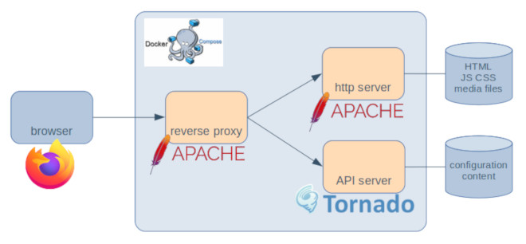

# otvl web developer documentation

[documentation index](../README.md)

## Repository structure

This repository is organized as following:

- dev: files used for development
- doc: documentation
- revproxy: a reverse proxy apache2 configuration for docker
- server: a REST API server implemented in python
- vuejs: the web site GUI is implemented with Vue.js and more specifically quasar

## Environment setup

### System setup for Vue.js (debian)

Node and npm

    # curl -sL https://deb.nodesource.com/setup_13.x | bash -
    # apt-get install gcc g++ make
    # apt-get install -y nodejs
    # node -v
    v13.5.0
    # npm -v
    6.13.4

Yarn (recommended)

    # curl -sS https://dl.yarnpkg.com/debian/pubkey.gpg | sudo apt-key add -
    # echo "deb https://dl.yarnpkg.com/debian/ stable main" | tee /etc/apt/sources.list.d/yarn.list
    # apt-get update && apt-get install yarn
    # yarn -v
    1.21.1

vue.js

    $ yarn global add @vue/cli
    $ vi ~/.profile
    if [ -d "$HOME/.yarn/bin" ] ; then
        PATH="$HOME/.yarn/bin:$PATH"
    fi
    $ vue --version
    @vue/cli 4.1.2

Quasar

    $ yarn global add @quasar/cli

### System setup for python

    # in a virtualenv
    pip install -r server/requirements-dev.txt

### Produce tgz archives for deployment

- Docker must be installed on the development environment.
- Tune VERSION and EXPORT_DIR in shell scripts.

Python server, the resulting archive contains a virtual env that must be installed
as /srv/venv/otvl_web:

    dev/shell/run_dkb_server.sh

Vuejs static files, the resulting archive must be deployed
as the root of a static web site:

    dev/shell/run_dkb_vuejs.sh

### Simulate deployment

The ovl_web application
comes with Dockerfiles to produce the different components of the following architecture.

If you have
[docker](https://docs.docker.com/)
and
[docker-compose](https://docs.docker.com/compose/)
installed on a development environment, you can run those components using the following commands:

    :::sh
    # run docker build for the three components
    $ dev/shell/run_dkb_for_compose.sh
    # run the three components with docker compose
    $ dev/shell/run_compose_up.sh [/path/to/a/specific/otvl_web/site]

The [otvl_ansible](https://github.com/t-beigbeder/otvl_ansible)
project provides
[Ansible](https://docs.ansible.com/ansible/latest/)
playbooks to deploy those components on physical or virtual servers using Debian buster.

## References

- [node installation](https://github.com/nodesource/distributions/blob/master/README.md#deb)
- [Vue.js](https://vuejs.org/)
- [Quasar framework](https://quasar.dev/)

